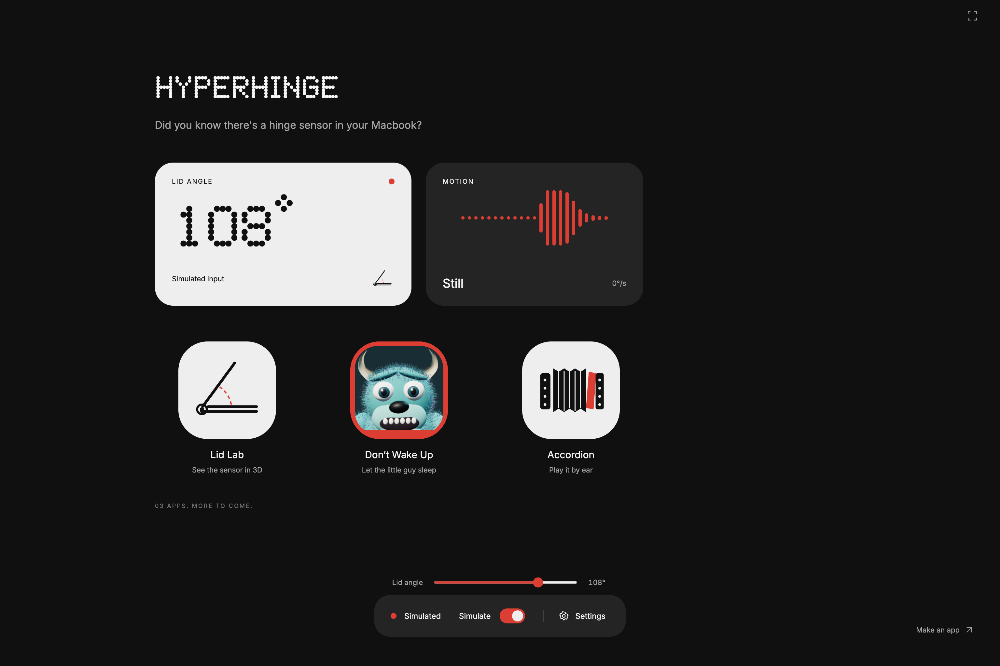

# HyperHinge

**Did you know there's a hinge sensor in your Macbook?**

A small Electron playground that turns your MacBook lid into a controller. A Nothing-inspired home screen, live angle widgets, and three apps sharing one native input service.



## Three apps, one hinge

- **Lid Lab** — a real-time 3D laptop explains the angle sensor. Move the lid, orbit the model, or switch to a side view.
- **Don’t Wake Up** — sneak toward a comfortable target angle without waking a furry 3D monster. Breathing, eyelids, eyebrows and limbs animate continuously. The home-screen icon is the same monster peeking through a window. Finish at 30°, 40°, 55° or 70°; never fully close the laptop to win.
- **Accordion** — pretend you're a virtuoso. A real MIDI transcription of Julián Arcas’s _Soleá_ provides the melody, bass and harmony. Move the lid for expression, press Space to play/pause, ←/→ to move between four-bar phrases, and ↑/↓ for octave shifts. No music theory required.

**Please build the fourth app.** A weird instrument, a physics toy, a tiny game, a useful accessibility experiment — contributions are welcome. The sensor, simulation, calibration and fullscreen are already handled. Start with the [contribution guide](CONTRIBUTING.md), [JS API](docs/native-api.md), and [example app](examples/angle-meter/AngleMeter.tsx).

## Run locally

Requires Node.js 22.12+ (or a compatible newer release) and npm. Live hardware input requires macOS, Xcode Command Line Tools, and a MacBook whose HID driver exposes the lid angle sensor. Browser simulation works without a MacBook.

```sh
git clone https://github.com/magiccube/hyper-hinge.git
cd hyper-hinge
npm install
npm run setup:assets
npm run dev
```

`setup:assets` obtains the exact third-party font and MIDI used by this local demo and verifies SHA-256 hashes. Their source files are not redistributed in Git; see [asset provenance](docs/third-party.md). If you already have the relevant assets, place them at the paths in `docs/assets.json`.

Some npm versions require permission for dependency install scripts. If Electron reports a missing executable after installation, run `node node_modules/electron/install.js`.

```sh
npm run dev:web      # browser preview, simulated input by default
npm run build        # typecheck, production renderer, native helper
npm test             # signal processing, game rules, MIDI provenance
npm run test:desktop # real Electron interaction tests; builds first
npm run package      # local Apple Silicon macOS .app in release/
```

The local .app is a development build, not signed or notarized for public distribution. No root access, accessibility permission, or system power-setting changes are required by the app.

## Controls

| Action                                | Control                                           |
| ------------------------------------- | ------------------------------------------------- |
| Open an app                           | Click its icon                                    |
| Fullscreen, including the home screen | Top-right button or **F**                         |
| Exit fullscreen                       | **Esc** or top-right button                       |
| Return home                           | Home button or **H**; **Esc** when not fullscreen |
| Try without moving the lid            | **Simulate**, then use the angle slider           |
| Save a comfortable reference          | **Settings → Calibrate**                          |
| Accordion play/pause                  | **Space**                                         |
| Previous/next four-bar phrase         | **← / →**                                         |
| Lower/higher octave                   | **↓ / ↑**                                         |

The simulator offers 15–140°. The native API preserves validated hardware readings of 0–180°. An actual 0° reading is possible in closed-display mode, but none of the interactions requires it. The app preserves macOS’s normal sleep behavior.

## Shared infrastructure

```text
Apple HID sensor
  → one read-only C helper (50 Hz requested)
  → one Electron main-process service
  → a narrow, sandboxed preload bridge
  → one shared JS store (filtering, velocity, calibration, simulation)
  → Lid Lab / Don’t Wake Up / Accordion / your next app
```

A mini-app uses `useHinge()` for React UI or `hinge.getSnapshot()` inside a render loop. It never spawns a helper, polls IOKit, or opens another hardware stream. Input continues consistently when switching apps.

```tsx
import { useHinge } from "../../hinge";

export function MyApp() {
  const { angle, velocity, direction, available } = useHinge();
  return (
    <p>{available ? `${angle.toFixed(1)}° · ${direction}` : "Try Simulate"}</p>
  );
}
```

See [docs/native-api.md](docs/native-api.md) for units, freshness semantics, cleanup, bridge contracts, and examples.

## Design and contribution rules

The shell is an iPad-like home screen with Nothing-inspired widgets and icons. **Ndot 57** is the display face; **Inter** handles readable UI text. The shell palette is red, black, white, light gray and dark gray. Colorful 3D game art is an explicit exception, not permission to recolor the UI.

- [Design language](docs/design-language.md) — exact tokens, fonts, layout, art boundaries, and forbidden patterns.
- [Native / JS API](docs/native-api.md) — the interface every app shares.
- [AGENTS.md](AGENTS.md) — conventions for coding agents and human contributors.
- [CONTRIBUTING.md](CONTRIBUTING.md) — add an app, report hardware support, or improve the playground.

## Hardware status

The native helper was verified on an M3 Pro MacBook Pro (`Mac15,6`): the HID read succeeded and reported 0° while macOS reported the clamshell closed. Interactive tests use simulated sweeps; physical open/close timing, different MacBook models and suspend/resume recovery still need hands-on testing. A device exposing the HID service does not guarantee every OS version permits reading it.

The sensor report is an undocumented device-specific feature accessed through public IOKit functions. Unsupported or stale input is displayed explicitly, with simulation available. Readings and game state stay local; there is no analytics, network control endpoint, or background login item.

## Credits

Visual inspiration: [Nothing OS](https://us.nothing.tech/nothing-os). Typography: Nothing / Colophon and [Inter by Rasmus Andersson](https://rsms.me/inter/). Music: [Arcas_Solea.mid on BitMidi](https://bitmidi.com/arcas_solea-mid); [historical score information](<https://imslp.org/wiki/Solea_(Arcas,_Juli%C3%A1n)>). MIDI synthesis uses an accordion-like reed timbre; this is not an accordion performance recording. See [third-party notes](docs/third-party.md).
