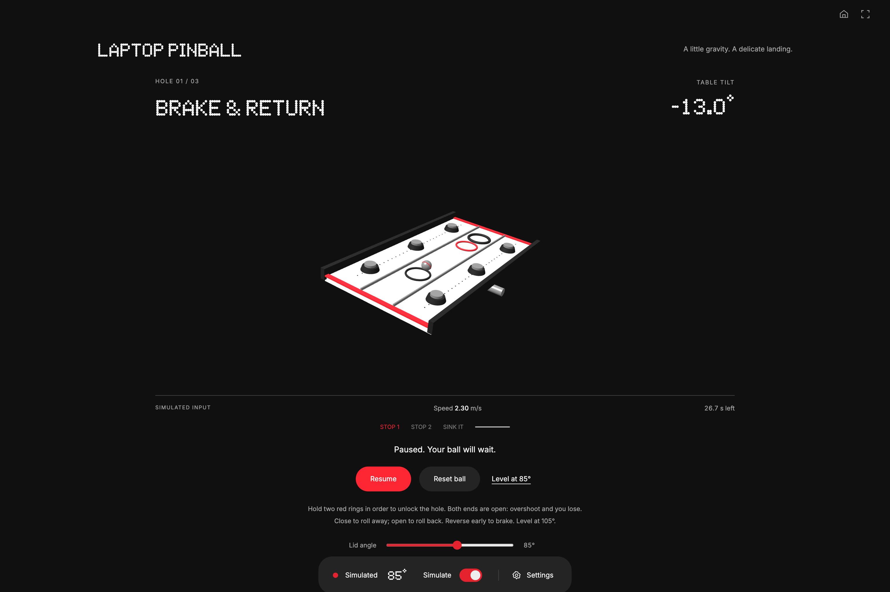

# Laptop Pinball

A hinge-only precision game. Closing the lid below the neutral angle tilts the whole 3D table away; opening above neutral reverses gravity. The ball has inertia, so players must brake before reaching a target.

## Course loop

1. Start rolling and settle on the red ring. Keep speed below the displayed threshold for the uninterrupted hold duration.
2. Reverse direction and hold the second ring. Moving too fast or leaving a ring resets its hold progress.
3. The final hole opens. Enter slowly before the timer expires.

Either open end drains the ball. A lost ball or expired timer ends the round; **Try again** resets it. Pause, unavailable input, focus loss, hidden documents and open dialogs freeze the simulation. Resume does not advance elapsed time during the gap.

| Course            | Time       | Maximum capture speed | Checkpoint hold |
| ----------------- | ---------- | --------------------- | --------------- |
| Brake & return    | 28 seconds | 0.65 m/s              | 0.55 seconds    |
| Thread the needle | 25 seconds | 0.50 m/s              | 0.70 seconds    |
| No room for error | 24 seconds | 0.40 m/s              | 0.80 seconds    |

A clear awards three stars when completed in less than 65% of the deadline, two below 85%, and one otherwise. Ratings describe the current round; no online leaderboard or persistent best-time storage is added.

The neutral angle defaults to 105°. While paused, **Level at…** can set a comfortable neutral between 75° and 120° and reset the round. Full closure is never required. Simulation and live input remain explicitly labeled in the shared dock and game readout.

## Implementation and verification

- All input comes from `src/hinge/index.ts`; no sensor or IPC changes.
- Fixed 120 Hz physics, frame-gap clamp, projected gravity and damping. One guided axis makes the lid the only required input.
- Three.js meshes include the actual hole and its cover, active checkpoint rings, rotating table and rolling ball. Render loops, resize observers, geometry, materials, shadow map and renderer are disposed on route exit.
- Six physics tests cover input direction, pause/unavailable freezing, terminal failure, continuous checkpoint holds, final capture and a controlled solution to every course within its deadline using 75–135° simulated input.
- Electron QA covers registry launch, tilt and speed changes, pause, unavailable input, reset, loss/retry, modal navigation, fullscreen and 320/375/414/768px layouts. Screenshots are visually inspected.
- Gameplay validation uses simulation. Physical hinge sweeps, human difficulty balancing and physical sleep/wake testing remain hands-on checks.

